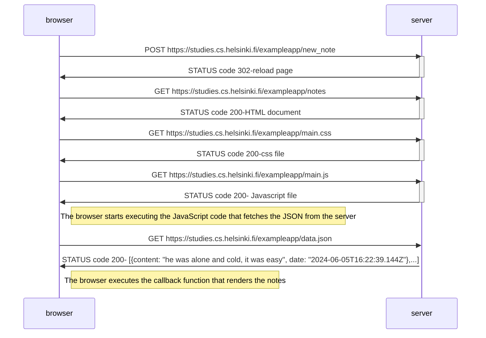

```mermaid
sequenceDiagram 
    participant browser 
    participant server

    browser->>server: POST https://studies.cs.helsinki.fi/exampleapp/new_note
    activate server 
    server->>browser: STATUS code 302-reload page 
    deactivate server 

    browser->>server: GET https://studies.cs.helsinki.fi/exampleapp/notes
    activate server
    server->>browser: STATUS code 200-HTML document 
    deactivate server 

    browser->>server: GET https://studies.cs.helsinki.fi/exampleapp/main.css
    activate server 
    server->>browser: STATUS code 200-css file 
    deactivate server 

    browser->>server: GET https://studies.cs.helsinki.fi/exampleapp/main.js
    activate server 
    server->>browser: STATUS code 200- Javascript file 
    deactivate server
    
    Note right of browser: The browser starts executing the JavaScript code that fetches the JSON from the server 
    
    browser->>server: GET https://studies.cs.helsinki.fi/exampleapp/data.json
    activate server
    server->>browser: STATUS code 200- [{content: "he was alone and cold, it was easy", date: "2024-06-05T16:22:39.144Z"},...] 
    
    Note right of browser: The browser executes the callback function that renders the notes
```
    

