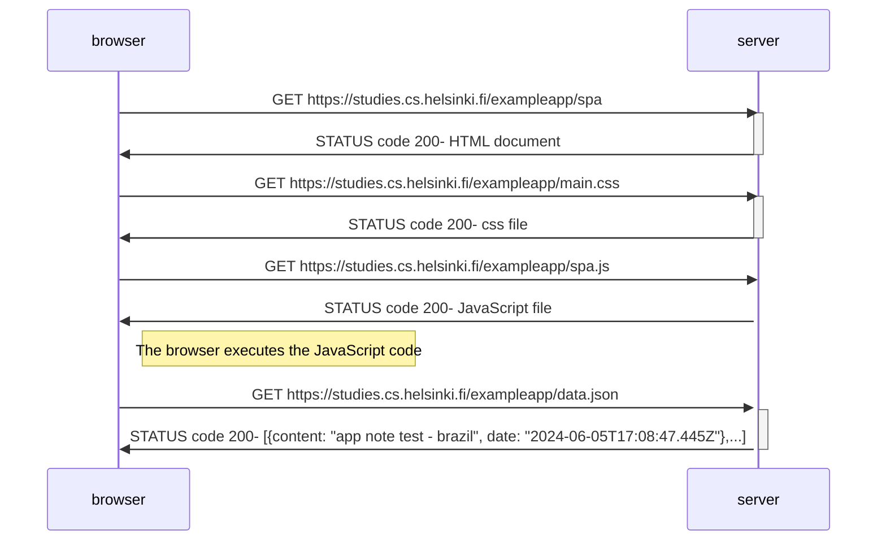

```mermaid
sequenceDiagram
	participant browser 
	participant server 
	
	browser->>server: GET https://studies.cs.helsinki.fi/exampleapp/spa
	activate server
	server->>browser: STATUS code 200- HTML document 
	deactivate server 

	browser->>server: GET https://studies.cs.helsinki.fi/exampleapp/main.css
	activate server 	
	server->>browser: STATUS code 200- css file 
        deactivate server 
	
	browser->>server: GET https://studies.cs.helsinki.fi/exampleapp/spa.js
	activate server 	
	server->>browser: STATUS code 200- JavaScript file 
	
	Note right of browser: The browser executes the JavaScript code 
	
	browser->>server: GET https://studies.cs.helsinki.fi/exampleapp/data.json
	activate server
	server->>browser: STATUS code 200- [{content: "app note test - brazil", date: "2024-06-05T17:08:47.445Z"},...]
	deactivate server
```
